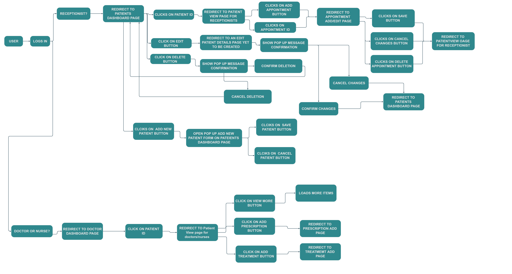
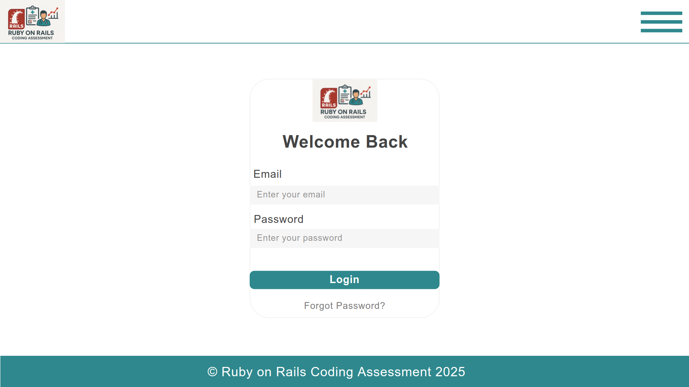
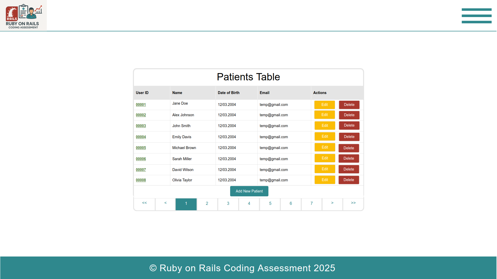
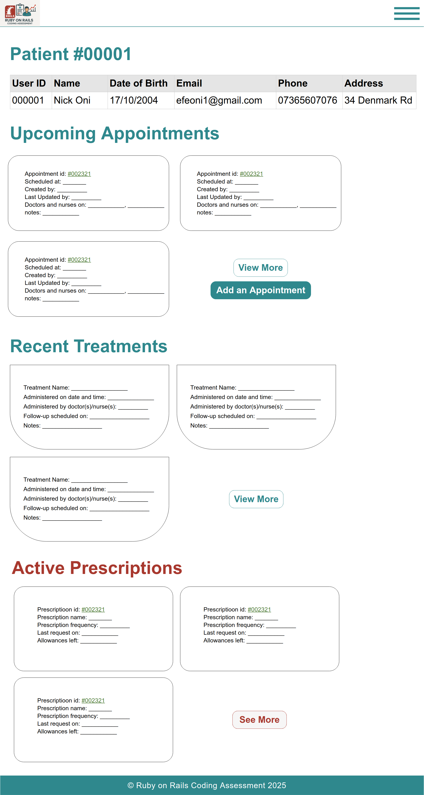
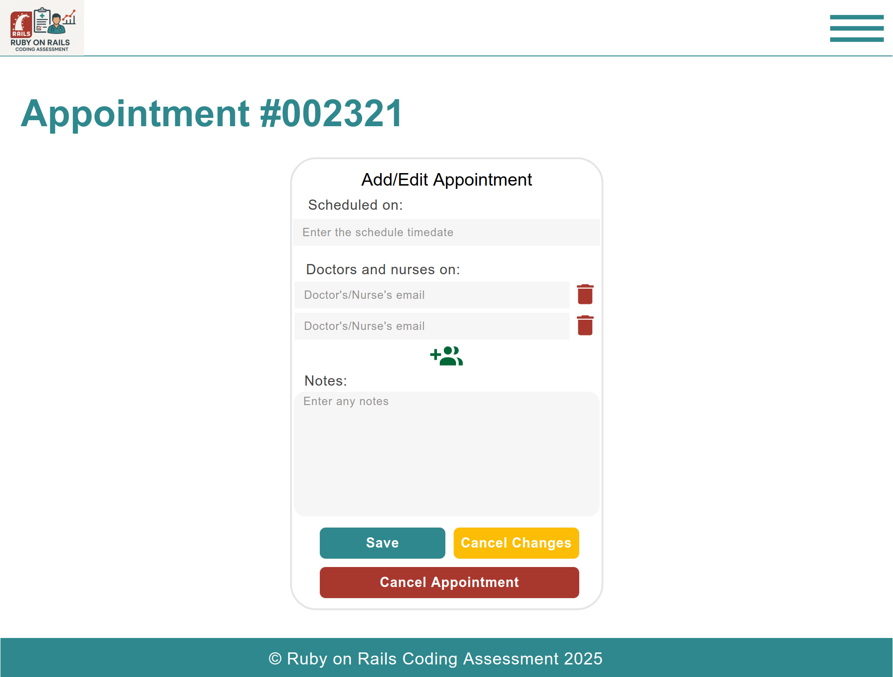
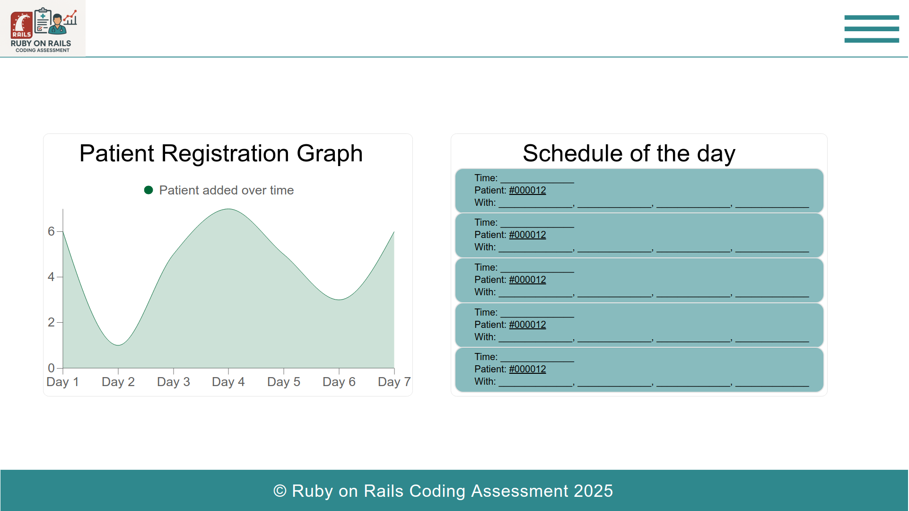
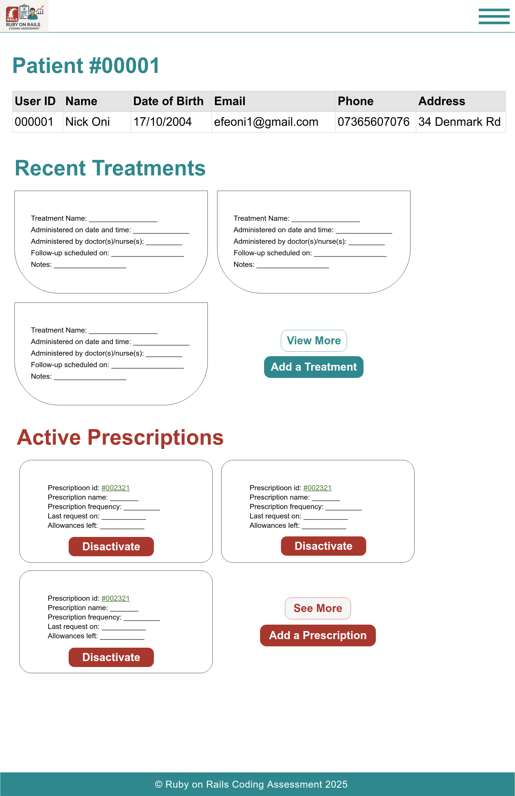
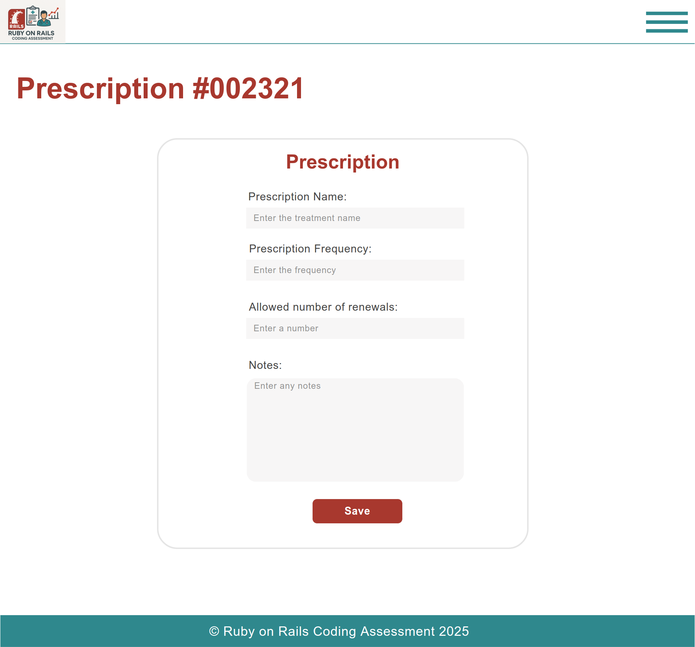
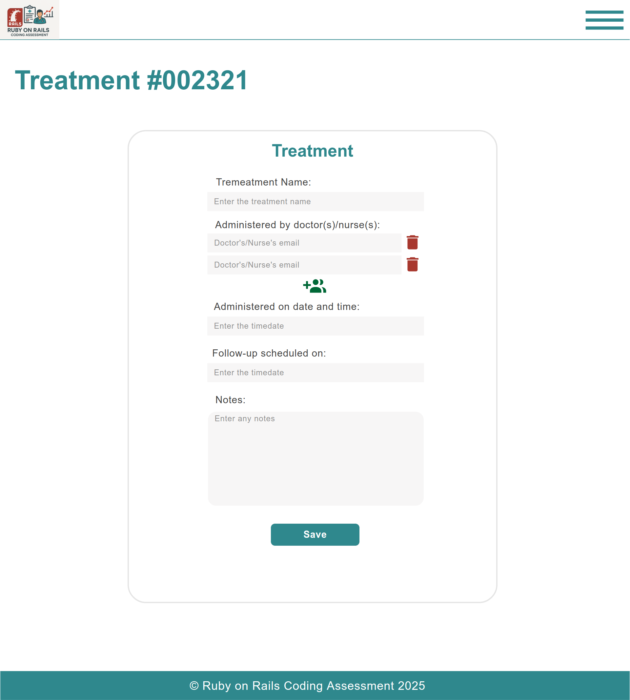

# 🏥 Ruby on Rails Patient Management System

A full-stack **role-based patient management system** built with Ruby on Rails, designed to streamline patient record management, appointments, prescriptions, and treatments for **Receptionists**, **Doctors**, and **Nurses**.

This project was developed as part of the **2025 Ruby on Rails Coding Assessment** for **Makerble**, with a focus on clear architecture, maintainability, and intuitive user interfaces for each role.

---

## 🎯 **Project Features**

✔ Role-specific user flows for Receptionists, Doctors, and Nurses
✔ Secure authentication with Devise
✔ Appointment scheduling with participant management
✔ Prescription creation and deactivation
✔ Treatment records with follow-up tracking
✔ Real-time role-based dashboards
✔ Mobile-responsive, Bootstrap-powered UI
✔ Data integrity with strong ActiveRecord associations

---

## 🖥 **Demo Videos**

The system walkthrough is split into two parts:

### 📽️ Full System Walkthrough (Part 1)

[Download Part 1](./demo/part%201.mp4)  
*Covers login, receptionist workflows, patient management, and appointment creation.*

### 📽️ Full System Walkthrough (Part 2)

[Download Part 2](./demo/part%202.mp4)  
*Covers doctor and nurse workflows, prescriptions, treatments, and system restrictions.*

---

### 🔗 **Prefer to Stream?**

You can also view both parts directly via [**Google Drive**](https://drive.google.com/drive/folders/1bF9i9xgyOUDFfBdAakh9kmIsG2pWHRYn?usp=sharing).

---

⚠️ *Note: `.mp4` files linked above will download locally — direct playback within GitHub is not supported.*

---

## 🗺 **User Flow Overview**



**Key Flows:**

* Login redirects based on user role
* Receptionists manage patients and appointments
* Doctors and Nurses access patient records but have limited editing rights
* All role-based views are isolated for security and simplicity

---

## 🔑 **Role-Based Functionality**

| Feature                        | Receptionist | Doctor/Nurse |
| ------------------------------ | ------------ | ------------ |
| View all patients              | ✅            | ❌            |
| Add/edit patient info          | ✅            | ❌            |
| Add/edit appointments          | ✅            | ❌            |
| View schedule and stats        | ❌            | ✅            |
| Add treatments & prescriptions | ❌            | ✅            |
| View patient records           | ✅            | ✅            |

---

## 🗂 **Moqqups**

<details>
<summary>🔐 Login Page</summary>



</details>

### Receptionist Views

<details>
<summary>👩‍💼 Patients Dashboard</summary>



</details>

<details>
<summary>👩‍💼 Patient Detail View</summary>



</details>

<details>
<summary>🗓️ Appointment Form</summary>



</details>

### Doctor/Nurse Views

<details>
<summary>👨‍⚕️ Dashboard (Stats & Schedule)</summary>



</details>

<details>
<summary>🧍 Patient Record View</summary>



</details>

<details>
<summary>💊 Add Prescription</summary>



</details>

<details>
<summary>💉 Add Treatment</summary>



</details>

---

## 🗃 **Database & Entity Relationship Diagram**

### Visual ER Diagram

[Database Diagram](./docs/diagrams/v2.0/db/db_diagram.png)

### Table Summary

* **Users:** Tracks authenticated users and roles
* **Patients:** Stores patient profiles
* **Appointments:** Schedules, with participant linking
* **Appointment Participants:** Maps doctors/nurses to appointments
* **Treatments:** Medical treatments and follow-up info
* **Prescriptions:** Prescription records with active status

A more detailed README can be found at 

---

## ⚙️ **Tech Stack**

* **Ruby on Rails 7.1**
* **PostgreSQL**
* **Bootstrap 5**
* **Devise for Authentication**
* Some **RSpec** for testing

---

## 🚀 **Setup & Installation**

```bash
# Clone the repo
git clone <repo-url>

# Navigate to project directory
cd ruby-on-rails-coding-assessment

# Navigate to web app project directory
cd web_app

# Install dependencies
bundle install

# Setup the database
rails db:setup

# Run the server
bin/rails server
```

**Default Roles:** You'll need to manually create users with roles of `receptionist`, `doctor`, or `nurse` for testing.

---

## 📦 **Project Structure Highlights**

```bash
ruby-on-rails-coding-assessment/
├── demo/                   # Demo videos (.mp4)
├── docs/
│   ├── diagrams/           # User flow & database diagrams
│   └── moqqups/            # UI mockups (versions 1.0 to 4.0)
├── web_app/                 # Full Rails backend & frontend application
│   ├── app/                 # Controllers, Models, Views
│   ├── config/              # Routes, environment config
│   ├── db/                  # Migrations & seeds
│   ├── public/              # Static assets
│   └── ...                  # Other standard Rails structure
└── README.md                # Project documentation

```

---

## 👨‍💻 **Author**

Developed by **Efeon \[Nick]**, as part of the **2025 Ruby on Rails Coding Assessment**.

---
