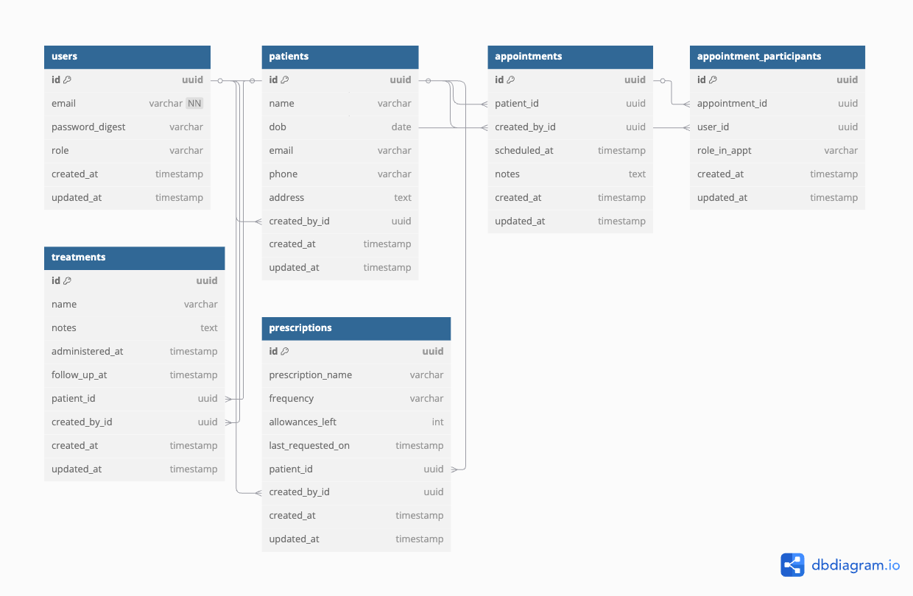

# ✅ Entity Relationship Diagram 

---

## ✅ Entity Relationship Diagram (Visual diagram)

---

## ✅ Entity Relationship Diagram (Text Representation)

---

### `users`

| Field            | Type      | Description                      |
| ---------------- | --------- | -------------------------------- |
| id               | UUID (PK) |                                  |
| email            | string    | Login credential                 |
| password_digest  | string    | Devise/BCrypt-auth support       |
| role             | enum      | `:receptionist, :doctor, :nurse` |
| created_at       | datetime  |                                  |
| updated_at       | datetime  |                                  |

---

### `patients`

| Field           | Type      | Description                          |
| --------------- | --------- | ------------------------------------ |
| id              | UUID (PK) |                                      |
| name            | string    |                                      |
| dob             | date      | Date of birth                        |
| email           | string    |                                      |
| phone           | string    |                                      |
| address         | string    |                                      |
| created_by_id   | UUID (FK) | References `users.id` (receptionist) |
| created_at      | datetime  |                                      |
| updated_at      | datetime  |                                      |

---

### `appointments`

| Field           | Type      | Description                          |
| --------------- | --------- | ------------------------------------ |
| id              | UUID (PK) |                                      |
| patient_id      | UUID (FK) | References `patients.id`             |
| created_by_id   | UUID (FK) | References `users.id` (receptionist) |
| scheduled_at    | datetime  | Scheduled date/time                  |
| notes           | text      | Optional description                 |
| created_at      | datetime  |                                      |
| updated_at      | datetime  |                                      |

---

### `appointment_participants`

| Field           | Type      | Description                          |
| --------------- | --------- | ------------------------------------ |
| id              | UUID (PK) |                                      |
| appointment_id  | UUID (FK) | References `appointments.id`         |
| user_id         | UUID (FK) | References `users.id` (doctor/nurse) |
| role_in_appt    | enum      | `primary_doctor`, `assistant_nurse`  |
| created_at      | datetime  |                                      |
| updated_at      | datetime  |                                      |

---

### `treatments`

| Field            | Type      | Description                          |
| ---------------- | --------- | ------------------------------------ |
| id               | UUID (PK) |                                      |
| name             | string    | E.g. "Antibiotic", "Wound Cleaning"  |
| notes            | text      | Additional details                   |
| administered_at  | datetime  | Date/time given                      |
| follow_up_at     | datetime  | When to return, if any               |
| patient_id       | UUID (FK) | References `patients.id`             |
| created_by_id    | UUID (FK) | References `users.id` (doctor/nurse) |
| created_at       | datetime  |                                      |
| updated_at       | datetime  |                                      |

---

### `prescriptions`

| Field               | Type      | Description                            |
| ------------------- | --------- | -------------------------------------- |
| id                  | UUID (PK) |                                        |
| prescription_name   | string    | E.g. "Paracetamol 500mg"               |
| frequency           | string    | E.g. "Twice a day"                     |
| allowances_left     | integer   | Number of times it can still be filled |
| last_requested_on   | datetime  | Last request for refill                |
| patient_id          | UUID (FK) | References `patients.id`               |
| created_by_id       | UUID (FK) | References `users.id` (doctor/nurse)   |
| created_at          | datetime  |                                        |
| updated_at          | datetime  |                                        |

---

## 🧠 Relationships Summary 

* `User` has many:

  * `patients` (if role = receptionist)
  * `appointment_participants`
  * `appointments` through `appointment_participants`
  * `treatments`, `prescriptions` they created (if role = doctor or nurse)

* `Patient` has many:

  * `appointments`
  * `treatments`
  * `prescriptions`

* `Appointment` has many `users` through `appointment_participants`

---
