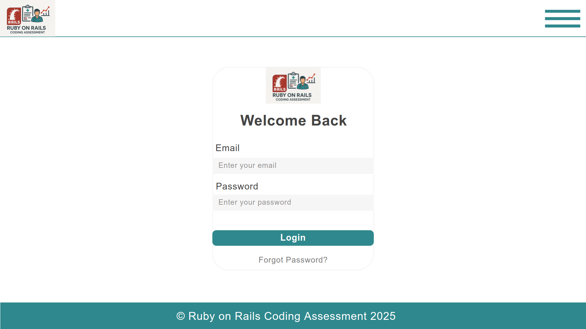
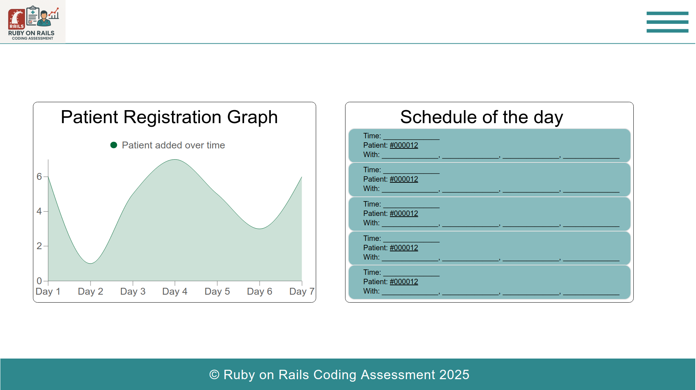
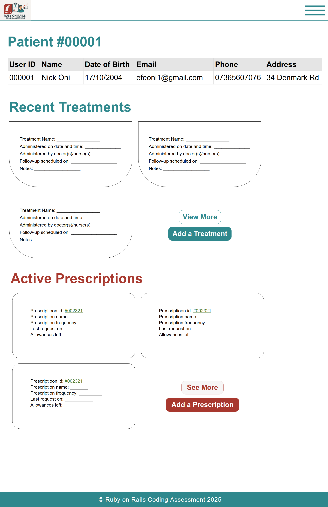
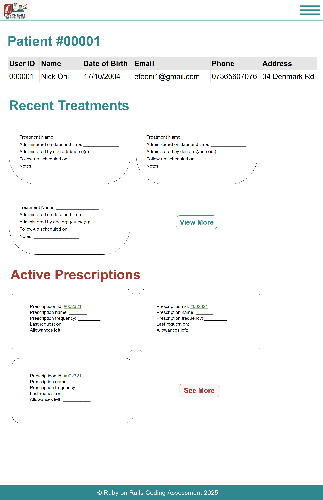
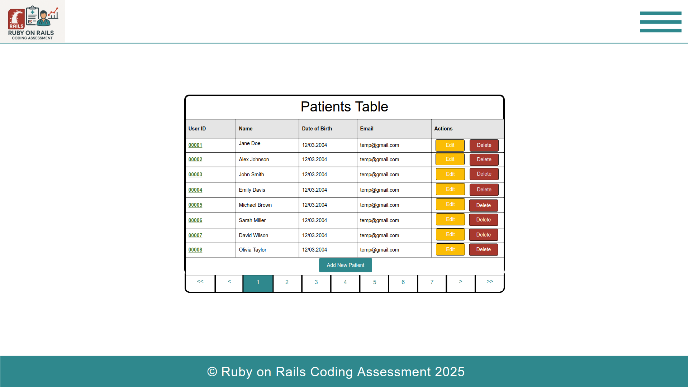
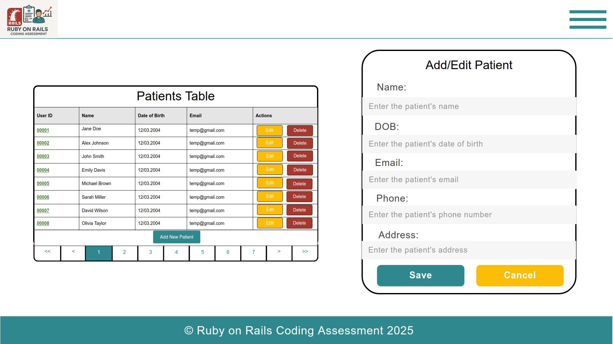

# 🏥 Ruby on Rails Patient Management System UI Design 

This folder contains a moqqup for a full-stack Ruby on Rails project designed for the **2025 Ruby on Rails Coding Assessment** for **makerble**. It provides two main user roles — **Receptionists** and **Doctors** — with tailored interfaces for handling patient data and appointment scheduling.

---

## A bit of an overview 
Here's a sneak peak for easy access: 

### 🔐 Login Page

### 👨‍⚕️ Doctor Dashboard

### 🩺 Doctor/Nurse Patient View Page

### 👩‍💼 Receptionist Patient View Page

### 👩‍💼 Receptionist Dashboard

### 👩‍💼 Receptionist Dashboard (With Patient Add Feature Version)

---

## 🔐 Authentication

- **Single Login Page**  
  Accessible to both Receptionists and Doctors using email and password credentials.
  - Route: `/login`
  - Shared authentication system with role-based redirection post-login.

---

## 👩‍💼 Receptionist Flow

### 1. **Patients Dashboard Page**
- Route: `/patients`
- Features:
  - Table of all registered patients (with pagination).
  - CRUD: Add, Edit, or Delete patients.
  - Integrated form for patient creation or updates.

### 2. **Patient View Page**
- Route: `/patients/:id`
- Accessible only to Receptionists.
- Shows detailed patient info:
  - Personal details (ID, name, DOB, contact).
  - **Recent Treatments**
  - **Active Prescriptions**
- Includes:
  - Buttons for adding treatments and prescriptions.
  - “View More” functionality to show full history.

---

## 👨‍⚕️ Doctor Flow

### 3. **Doctor Dashboard**
- Route: `/dashboard`
- Features:
  - **Patient Registration Graph** — Visual representation of patients registered over the week.
  - **Schedule of the Day** — Appointments with timestamps and associated patients.

> Note: Nurses are not a separate role in the system; nurse data appears in treatment metadata but shares the same UI as doctors.

---

## 📊 Key Features

- ✅ Role-based dashboards (Receptionist vs Doctor)
- ✅ Full patient CRUD system
- ✅ Treatment & Prescription management per patient
- ✅ Daily schedule overview
- ✅ Data visualization of patient trends

---

## 🧩 Potential Extensions

- Appointment creation (assigning multiple doctors/nurses)
- Nurse-specific dashboard (currently same as doctor)
- Admin role for user/role management
- Search & filter functionality on tables

---
